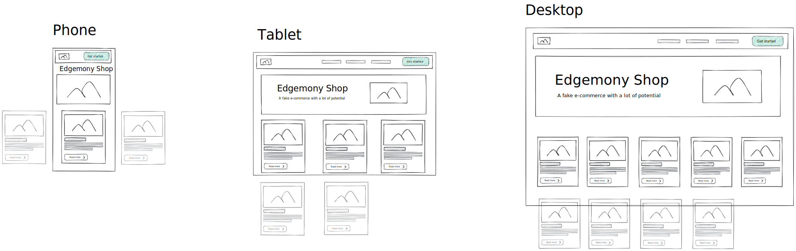
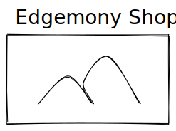
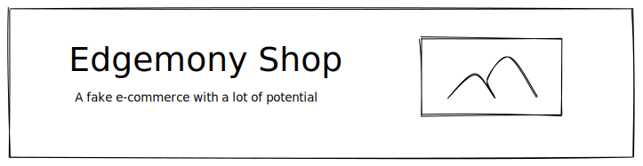
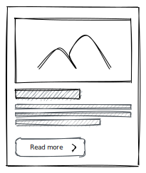

# Esercitazione 01-03-21

Homepage di un sito e-commerce




# Istruzioni

L'homepage deve essere composta da:
- header
- hero
- lista di card prodotto
- footer

Tutti i dati necessari sono contenuti nell'oggetto `data` che trovate in `App.js`:

```javascript
const data = {
  title: "Edgemony Shop",
  description: "A fake e-commerce with a lot of potential",
  logo:
    "https://edgemony.com/wp-content/uploads/2020/03/cropped-Logo-edgemony_TeBIANCO-04.png",
  cover:
    "https://images.pexels.com/photos/4123897/pexels-photo-4123897.jpeg?auto=compress&cs=tinysrgb&dpr=2&h=750&w=1260",
  products: fakeProducts,
};
```

Create tutti i componenti che ritenete necessari.
Prestate attenzione al css. L'app deve apparire ordinata e minimamente professionale.
Lo stile deve essere minimale.

Il sito deve essere responsive.

> **Opzionale**: su mobile la lista prodotti può essere visualizzata in un carousel. Se non riuscite, visualizzateli uno sotto l'altro.


## Header

L'header contiene il logo, allineato a sinistra.

---

## Hero

L'hero è un banner contenente un'immagine e del testo.

Su mobile viene visualizzato un `title` (`h1`) e sotto un immagine.



Su tablet e desktop vengono visualizzati `title` (`h1`) e `description` (`h2`), sovrapposti all'immagine.



---

## Card prodotto

I prodotti devono essere visualizzati come card prodotto.
La card prodotto deve contenere:
- immagine
- titolo
- prezzo
- un pulsante con testo "View details" (al momento non fa nulla quando cliccato)



---

## Consegna

Fate un fork di questo progetto (https://github.com/edgemony-coding-bootcamp/edgemony-shop).
Per fare un fork cliccate sul taso "Fork", in alto a destra.
Verrà creato una vostra copia di questo progetto, su cui lavorerete.

- create il branch `esercitazione-01-03-21`
- fate i vostri commit
- fate il push del branch: `git push --set-upstream origin esercitazione-01-03-21`
- spostatevi sul branch `main`
- mergiate il vostro branch: `git merge --no-ff esercitazione-01-03-21`
- fate il push di `main`